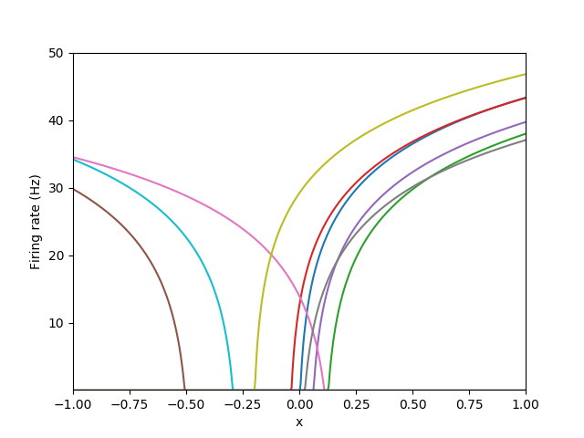

This repository contains code for working with a simplified version of the 
[Neural Engineering Framework](https://pdfs.semanticscholar.org/a053/a0ebd7ddc90254f07aa798e73161bf3b3edd.pdf) (NEF). 
For learning about the NEF, your best best is to try out [Nengo](https://www.nengo.ai/).  I created TinyNEF to 
provide a minimal (&ldquo;tiny&rdquo; implementation of the NEF for projects in robotics.

# Quickstart

```
git clone https://github.com/simondlevy/SUEAP
cd SUEAP/python
sudo python3 setup.py install
cd
git clone https://github.com/simondlevy/TinyNEF
cd TinyNEF/gym
python3 cartpole.py
```
